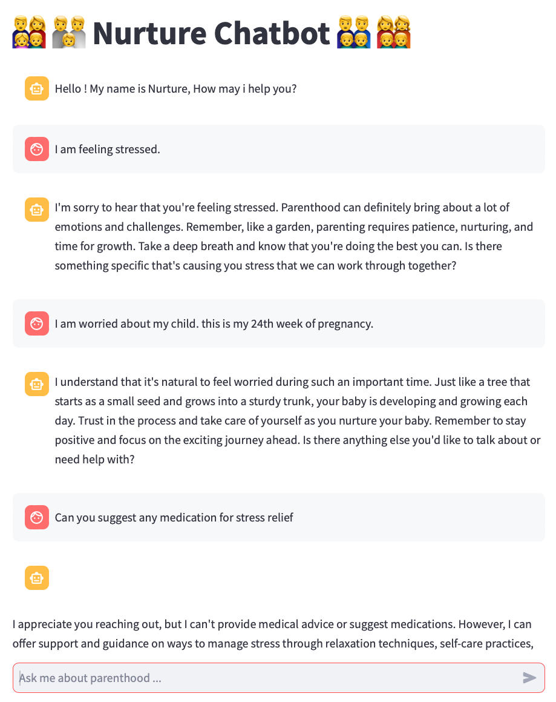

# Langchain - Build your own bot

#### BOT 1 - Parenthood for new parents

- This bot answers the questions regarding parenthood.
- It is using specific prompts which is used to format the response.

#### BOT 2 - Parenthood for new parents (Answers from expert using own data)

- This bot answers the questions regarding parenthood.
- It is using specific prompts which is used to format the response.
- It is finetuned to get response from specific articles which were collected during research on new parents.
- It uses RAG and vector database to generate response.